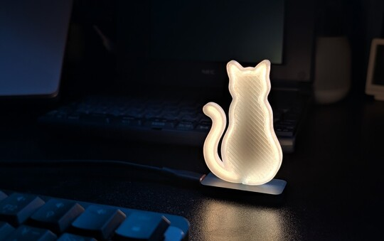
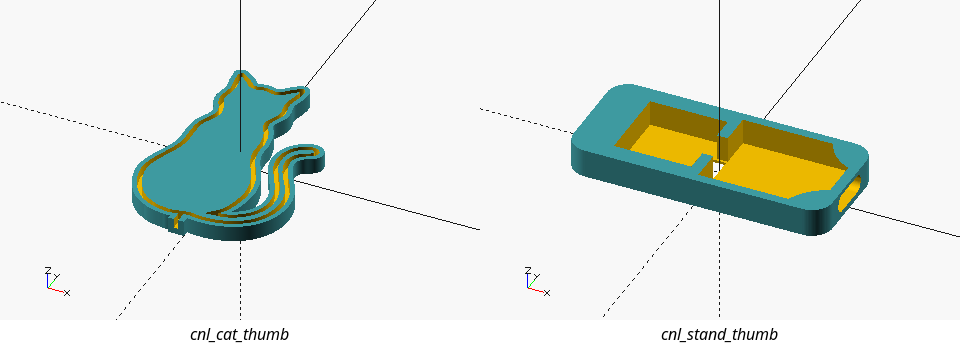
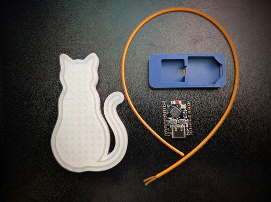
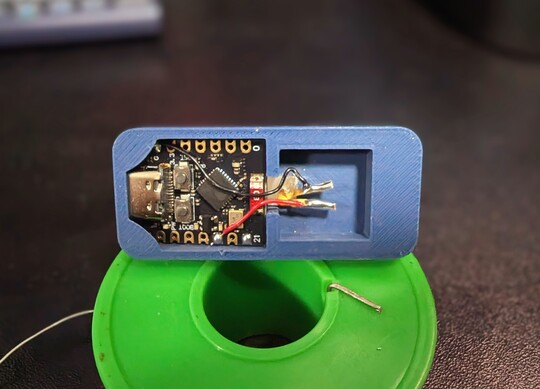
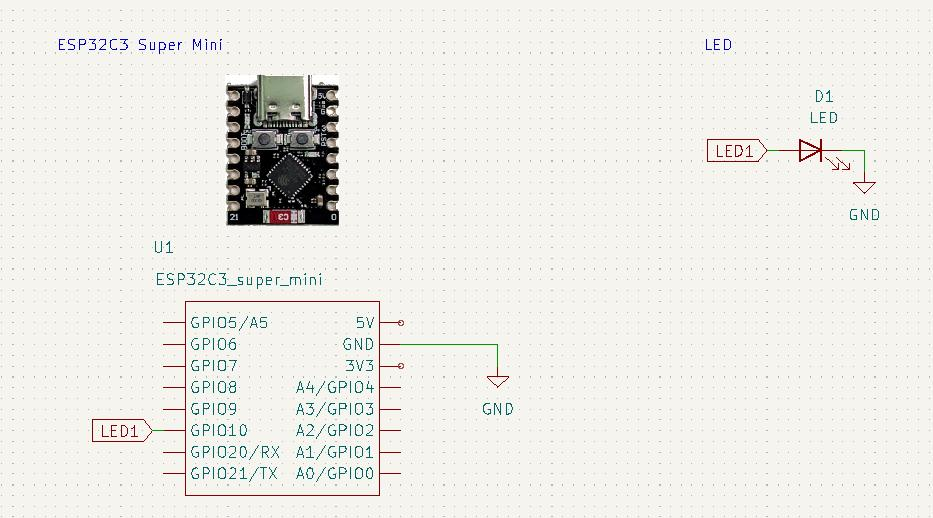

<div align="center">
  
</div>


# Cat/Nyaight/Light

_In the deep of Nyaight, a cat glows._

A cat shaped night light powered by ESPHome.

## BOM

| Component                    | Quantity | Notes |
| :--------------------------- | :------- | :---- |
| ESP32-C3 Super Mini          | 1        |       |
| Flexible LED filament (30cm) | 1        | 2200K |
| Wire                         | -        |       |
| LOCTITE                      | -        |       |

## 3D Printed Parts

- See the [`./enclosure`](./enclosure/) directory.



## Assembly Instructions

- Print the parts.  
  
- Insert the LED filament into the enclosure.  
  
- Connect the LED filament to the GND and GPIO10 pins of the ESP32-C3 Super Mini. (Insulate the contacts with tape.)  
    
  
- Apply a drop of LOCTITE to join the stand and cat parts.

## Firmware

- The firmware is built using [ESPHome](https://esphome.io/). 

```yaml
# In your ESPHome config file:
output:
  - platform: ledc
    id: pwm_out_1
    pin: GPIO10
    frequency: 4882Hz

light:
  - platform: monochromatic
    output: pwm_out_1
    name: "Cat"
    effects:
      - pulse:
          name: "Meow"
          transition_length:
            on_length: 1s
            off_length: 0.7s
          update_interval: 1.5s
          min_brightness: 40%
```

```yaml
# Example automation for Home Assistant.
alias: Wake cat at sunset
triggers:
  - trigger: sun
    event: sunset
    offset: 0
conditions: []
actions:
  - type: turn_on
    device_id:
    entity_id:
    domain: light
mode: single
---
alias: Sleep cat at sunrise
triggers:
  - trigger: sun
    event: sunrise
    offset: 0
conditions: []
actions:
  - type: turn_off
    device_id:
    entity_id:
    domain: light
mode: single
```

## License

MIT