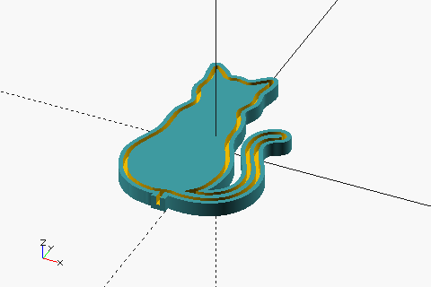
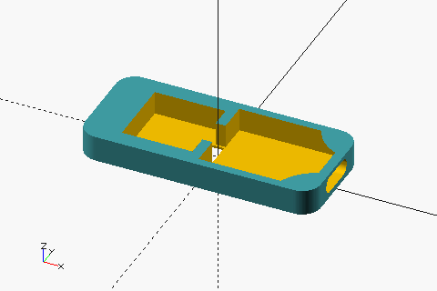

# cnl/enclosure

## Prerequisites

- OpenSCAD (nightly build) 2026.01
- GNU Make
- ImageMagick
- BOSL2 (included as submodule)

## Build

```sh
# Sync submodules
$ git submodule update --init --recursive

# Generate .scad and .stl files.
$ make all -B

# Generate thumbnail images.
$ make images -B
```

## Parts

|                                   | STL                              |
| --------------------------------- | -------------------------------- |
|    | [cnl_cat.stl](./cnl_cat.stl)     |
|  | [cnl_stand.stl](./cnl_stand.stl) |

## Print conditions

- 1.75mm PLA (Transparent, Matte Blue)
- 0.12mm layer height
